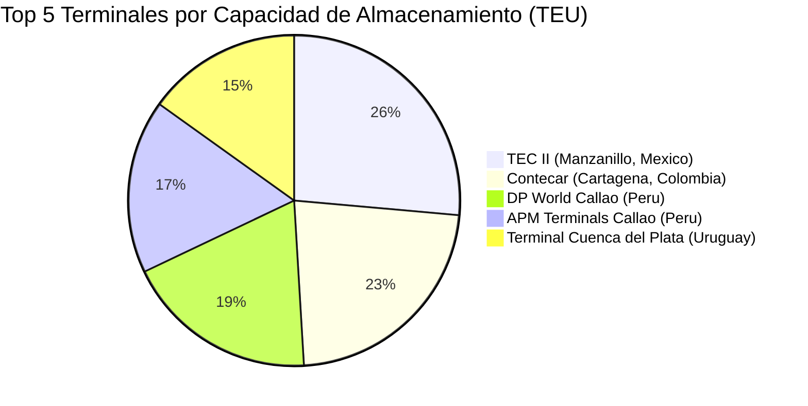

# Clase Cinco - 7 de Agosto del 2026

# Repaso

* Large Language Models
  * Open Source
    * Super importantes cuando hablamos de privacidad de datos
    * Ejecucion de modelos Localmente
      * LMStudio
      * Ollama
    * Hugging Face
      * Spaces
    * Groq
  * Propietarios
    * Gemini
      * Modo Investigacion
* Herramientas
  * Text-To-Speech
    * Natural Readers
  * Visualizacion
    * Napkin
* Prompt Engineering
    * Tips
      * Usar a la IA como experto en prompt engineering
      * Usar el modo voz para dale mas contexto
    * Prompt
      * Tarea + Contexto + Ejemplos + Rol + Formato + Tono
    * Contexto
      * (prompt) -> (+ memoria) -> (+ herramientas) -> (+ conversacion actual/pasadas) -> (+ Instrucciones personalizadas/System Prompt) -> (llm)
    * Tecnica de promting
      * Prompt Chainning / Interaccion
        * Generar una conversacion con todo el conexto necesario
      * Rol/Persona
        * Rol / Persona PArticular / Panel de Expertos

---

# Prompt Engineering

## Tips de Prompt engineering

* La ia generalmente le pedis algo y agrega una intro y una pregunta de follow up
 * Ejemplo:
    * (intro) "Voy a hacer tal cosa en...."
    * (contendo)
    * (follow-up) Queres que ademas haga tal o cual cosa?
 * Si yo quiero solamente el contenido sin la intro ni el follow up se lo pido
   * "Dame el contenido como para copiar y  pegar sin acotar nada mas" 

## Formatos de Salida

* Como le puedo pedir a la IA que responda

* Pedirle a la Una lista de algo sin formato
  * "Quiero una lista de 10 terminales como Exolgan que trabajen con contenedores estimando ubicacion, cantidad de contenedores que pueden almacenar, volumen diario de traslados, importancia en el sector y otros datos que sean relevantes. Investigar en internet."
* Tecnicos
  * JSON
    * "Dame la lista en JSON
  * XML
    * "Dame la lista en XML
* Pseudo Tecnicos
  * Generar un pdf
    * Lo hace pero es visualmente muy limitado
  * Generar un Word
    * Generamelo en word
  * HTML
    * "Me podes generar la lista en un unico html para presentar que se vea moderno, profesional, si es posible con imagenes, que sea apto para imprimit y que pueda madar a un cliente o un jefe."
    * ChatGPT hace una previsulizacion (parecido a los artefactos de Claude)
    * Tiene mucha mejor pinta visual que el pdf que generamos antes
    * Se puede descargar, lo abris y lo imprims con ctrl+p
    * Se puede iterar sobre el formato, el contenido, etc...
* Representacion Tabular
  * Como Tabla
    * Generarme la informacion como una tabla
  * En CSV
    * Es un formato portable que excel interpreta nativamente
    * "Dame la lista en csv"
    * Se puede compatir
      * https://chatgpt.com/s/t_6a75e46839e8819199d899423ff3922c
    * "Dame el csv para descargar" (Lo tuve que hacer con claude gaste mis tokens del dia para chatgpt)
    * Lo puedo abrir con Excel
* Sencillos
  * La idea es que podes controlar el formato de salida
  * En bullets
  * En cartas

### Markdown

* Es el formato en el que esta escrito este documento
* Guia de Wikipedia
  * https://es.wikipedia.org/wiki/Markdown
* Es el formato en que la IA genera las respuestas
  * La IA entiende perfecto markdown
  * Si copio la respuesta de la IA de chatgpt y lo pego en el notepad veo que lo que realmente genero la IA es markdown
* Usos
  * Para definir una plantilla exacta de como quiero la respuesta
     * Bajar el no determinismo de la ia
   * Sirve para al copiarlo en word mantener los titulos, negritas, etc
      * Problema: No les paso nunca de generar algo con IA, copiarlo en word, y el tiempo que me ahorre generando la info ahora lo tengo que invertir en ajustar el formato de la respuesta
     
* Ejemplod e plantilla

```
# [NOMBRE TERMINAL]

## Datos Generales

* Pais : [PAIS DE LA TERMINAL]
* Provincia : [PROVINCIA DE LA TERMINAL]
* Direccion : [DIRECCION DE LA TERMINAL]
* Inaguracion : [FECHA INAGURACION]
* Operador : [OPERADOR TERMINAL]

# Estadisticas

* Movimientos diarios estimados: [MOVIMIENTO DIARIO]
* Capacidad anual: [CAPACIDAD ANUAL]
* Capacidad almacenamiento: [CAPACIDAD ALMACENAMIENTO]
* Cantidad Empleados: [CANTIDAD EMPLEADOS]

# Biografia

> [DESCRIPCION DOS ORACIONES SOBRE LA TERMINAL]

--- << Separador

```

* Prompt

```
Dame la lista segun esta plantilla markdown "

# [NOMBRE TERMINAL]

## Datos Generales

- Pais : [PAIS DE LA TERMINAL]
- Provincia : [PROVINCIA DE LA TERMINAL]
- Direccion : [DIRECCION DE LA TERMINAL]
- Inaguracion : [FECHA INAGURACION]
- Operador : [OPERADOR TERMINAL]

# Estadisticas

- Movimientos diarios estimados: [MOVIMIENTO DIARIO]
- Capacidad anual: [CAPACIDAD ANUAL]
- Capacidad almacenamiento: [CAPACIDAD ALMACENAMIENTO]
- Cantidad Empleados: [CANTIDAD EMPLEADOS]

# Biografia

> [DESCRIPCION DOS ORACIONES SOBRE LA TERMINAL]

\--- << Separador" investiga en internet los datos que falten
```

* En mi caso tuve que ponerle luego

```
Devolvelo interpretado. Sin acotar nada mas
```

> [!NOTE]
> Lo copio en word y veo como respeto todo el formato, no tengo que modificar los titulos, etc

---

### Mermaid

* Un formato para generar diagramas
* URL
  * https://mermaid.live/
* Las IA suelen incluir previsualizacion de los diagramas mermaid
* Ejemplos de diagramas
 * Pie
 * Flowchart

#### Pie

* Siguiendo la conversacion de la lista de terminales

```
Me podes generar un diagrama de pie mermaid donde se visualize el la capacidad de las 5 terminales con mas capacidad.
```

* Me genera


   
---

# Glosario

* No Determinismo : El mismo prompt no produce siempre la misma respuesta
