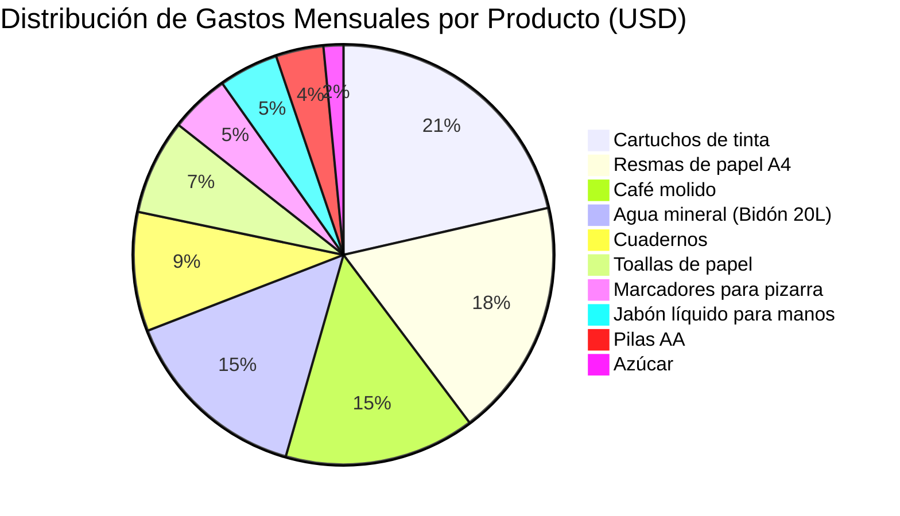
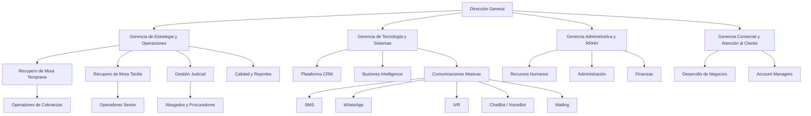

# Clase Cuatro - 9 de Junio del 2026

# Repaso

* Herramientas
  * There IS an AI For That
  * Natural Readers
* LLM
  * Open Source
    * HF : Hugging Face
      * Respositorio para subir modelos open source
      * Space de HF
    * Mistral
    * Groq
    * Ejecutar Modelo Localmente
      * LMStudio
      * Ollama
  * Propietarios
    * Grok
    * Gemini
      * Modo Investigacion
* Prompt Engineerings
  * Formula = Tarea + Contexto (Memoria + SystemPrompt + InstruccionesPersonalizadas + Herramientas) + Ejemplo + Rol + Formato + Tono
  * Tip : Usar Microfono para mas conxtexto
  * TIP : Usar la IA como prompt Engineering
  * Patrones/Tecnicas de Prompting
    * Contexto
      * Prompt Chainning / encadenamiento de Prompts / Metodos Socratico

---

# Herramientas

## Napkin

* URL
  * https://www.napkin.ai/
* Caracteristicas
  * Permite enriquecer un texto con imagenes/diagramas
* Puntaje
  * 9 / 10

---

# Prompt Engineering

## TIP

* Agregar al prompt : Devolverme solamente el coneido para copipar y pegar sin acotar nada mas

## Rol

* Solapa 1 : Prompt Solo Tarea
  * "Dame estrategias para cobrar una deuda a un cliente moroso"
  * https://chatgpt.com/g/g-p-6a04b4fb70008191b7deeecd6ae4ba19-promting-rol/shared/c/6a28429b-4058-83e9-af78-9c032c22967d?owner_user_id=user-FiOaCNjhGgtJ4Aa4tiv8Ommy
* Solapa 2 : El mismo prompt especificando un rol
  * "Actua como un experto en persuacion nivel fbi especialista en morosidad y cobre de deudas. Dame estrategias para cobrar una deuda a un cliente moroso"
  * https://chatgpt.com/g/g-p-6a04b4fb70008191b7deeecd6ae4ba19-promting-rol/shared/c/6a28429d-4810-83e9-9e42-3ceb917324a3?owner_user_id=user-FiOaCNjhGgtJ4Aa4tiv8Ommy
* Solapa 3 : El mismo prompt especificando una persona especifica
  * "Actua como Ricardo Fort. Dame estrategias para cobrar una deuda a un cliente moroso"
  * https://chatgpt.com/g/g-p-6a04b4fb70008191b7deeecd6ae4ba19-promting-rol/shared/c/6a28429f-6a6c-83e9-ad46-d984a82b88c4?owner_user_id=user-FiOaCNjhGgtJ4Aa4tiv8Ommy
* Solapa 4 : Citar a una panel de experto (varios roles)
   * "Quiero que armes un panel de expertos donde cada uno daestrategias para cobrar una deuda a un cliente moroso. Quiero un parrador o pocos parrafos segun cada experto. "
   * https://chatgpt.com/g/g-p-6a04b4fb70008191b7deeecd6ae4ba19-promting-rol/shared/c/6a2841ee-4938-83e9-adc1-f2f599a30f64?owner_user_id=user-FiOaCNjhGgtJ4Aa4tiv8Ommy

## Formato

* Algunos formatos que debemos conocer para sacarle todo el jugo a la IA

* Lista sin formato
  * "Dame una lista de compras mensual para una oficina. Producto, cantidad, departamento,  precio, motivo. Los datos pueden ser aproximados. dame la lista de 10 elementos."
 * Formatos Tecnicos
   * JSON
    * Dame la lista en json
   * XML
    * Dame la lista un xml
* Formatos Pseudo Tecnicos
  * HTML (el de la web)
   * Sirve, por ejemplo para generar pds 
     * "Generame la lista en un unico html profesional y elegante que se pueda mandar a mi jefe"
     * Luego "Me generas el html para desgargar"
     * Click en achivo para descargar el html
     * Ctrl+P lo podes imprimir como pdf
* Formato para Interactuar con Excel
    * CSV (Comma Separated Values)
    * "Dame la lista como un csv"

### Especificacion de Plantillas de salida con Markdown

* Markdonw es el lenguaje que genera la IA por defecto para darle forma al texto
  * https://es.wikipedia.org/wiki/Markdown

* Generar ua plantilla en mardwon como quiero la respuesta
* Dame una lista de compras mensual para una oficina. Producto, cantidad, departamento,  precio, motivo. Los datos pueden ser aproximados. dame la lista de 10 elementos."
* 
```
# [Producto]

## Motivo
> [MOTIVO]

## Valores
* **Cantidad** : [CANTIDAD DEL PRODUCTO]
* **Precio** : [Precio DEL PRODUCTO]
* **Total** : [Precio x Cantidad]

## Depatamento
*[Departamento que lo solicito]*
---
```

> [!NOTE]
> Esto sirve para que al copiar la respuesta del llm a word se conservern titulos, negrita y ahorrarme todo el tiempo que antes de gastaba en darle formato a la respuesta de la IA cuando la copiaba a word

##  Diagramas con Mermaid

* "Generame un diagrama de PIE en mermaid para ver la distribucion de gastos de los productos"



* Armame un diagrama mermaid de flowchart donde se vea el organigrama de la empresa de conbranzas Muller



---

# Glosario

* La Ia no es deterministica : El mismo prompt no siempre devuelve la misma respuesta
