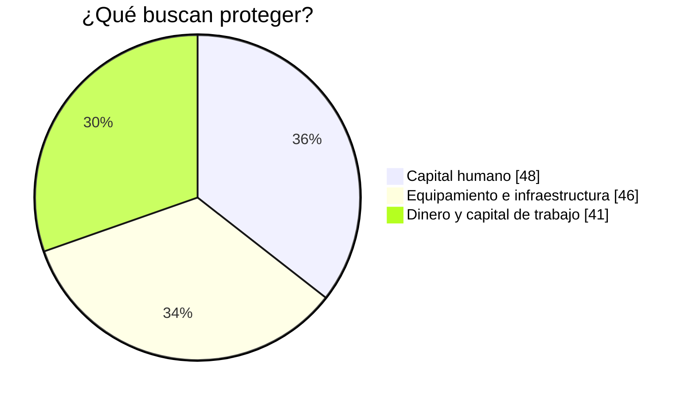

# Clase Dos - 28 de Septiembre del 2026

# Repaso

* Gemini
  * Gemini Notebook
    * Tipos de Fuentes
      * Pdf, ppt
      * Videos
      * Links de Youtube
      * Utilizar informacion agregada como nueva fuente
    * Tareas
      * Analizar
      * Metodologia de uso de la herramienta
      * Prompt a la hora de generar video / presentacion
    * Personalizacion de la respuesta
      * Definir un "system prompt" para gemini notebook
  * Modo invenstigacion
* Prompt Engineering
  * Mejorar los prompts con IA
* Microsoft
  * Los cuadernos de 365 tomaron mucha inspiracion en notebooklm

---

# Comunicacion de Ideas

## Repaso Napkin

* Partiendo de la investigacion de la clase pasada
  * https://share.gemini.google/S8elo971Km6W
* Integrar la investigacion en napkin
  * https://www.napkin.ai/
 
* Genera imagenes como esta:


* Puntaje : 9 / 10
  * Lamentablemente el uso gratuito lo fueron limitnado
 
## Generacion de presentaciones

### Power Point en 365

* Para esto tenemos Copilot para Powerpoint
* Voy a tomar el texto de la investigacion y le voy a pedir a Copilot que me haga una presentacion

> [!NOTE]
> La idea no es quedarnos con la presentacion que hace copilot sin mas.
> Es una base para empezar a trabajar

* Puedo tomar la presentacion y enriquecerla con una imagen de Napkin

---

### Alternativa : Gamma

* La mejor alternativa para presentaciones fuera del ecosistema Microsoft : Gamma
    * https://gamma.app/signup?r=cjucljp9heegmkv

* No solo se limita a PPT
  * Presentacion
  * Pagina Web
  * Documento
  * Para redes sociales
  * Graficos
 
* Compartiva con PowerPoint
  * Suelen ser presentaciones mas visuales que incluyen inagenes generadas por IA
 
* La idea que si hay diapositivas que me gustan, las puedo exportar como ppt y hacer un mix con mi powertpoint o incluso partir de la version de Gamma y editarlo con Copilot para powertpoing

---

# Generacion de diagramas con Copilot / ChatGPT

* Opciones para generar diagramas desde ChatGPT
  * Mermaid (https://mermaid.live/)
    * Lenguaje estandar para generar diagramas a partir de texto
    * Trae una serie de graficos predeterminado
    * Sus opciones de personalizacion son limitadas
  * SVG (Scalable Vector Grapics)
    * Es un lenguaje estandar basado en xml para hacer graficos
    * Los modelos al principio no eran tan buenos generando SVG pero cada vez se vuelven mas capaces
    * Cuando el grafico que busco no esta en Mermaid y necesito algo mas personalizado o editable, utilizo SVG
  * MatPlotLib

## Mermaind

Por ejemplo, vamos a generar un diagrama mermaid con Copiot / ChatGPT para esto 

```
Qué buscan proteger​ :
* Capital humano: 48%​
* Equipamiento e infraestructura: 46%​
* Dinero y capital de trabajo: 41%​
```

*  Me genera este grafico



### SVG

* Ejemplo carita sonriendo

```svg
<svg xmlns="http://www.w3.org/2000/svg" width="200" height="200" viewBox="0 0 200 200">
  <!-- Cara -->
  <circle cx="100" cy="100" r="90" fill="#FFD93D" stroke="#333" stroke-width="4"/>

  <!-- Ojos rojos -->
  <circle cx="70" cy="80" r="10" fill="#FF0000"/>
  <circle cx="130" cy="80" r="10" fill="#FF0000"/>

  <!-- Sonrisa -->
  <path d="M60 120 Q100 160 140 120"
        fill="none"
        stroke="#333"
        stroke-width="6"
        stroke-linecap="round"/>
</svg>
```

## Integracion de Herrmienta

* Partiendo de una herramienta no me quedo sola con esa, sino que puedo integrarlas
