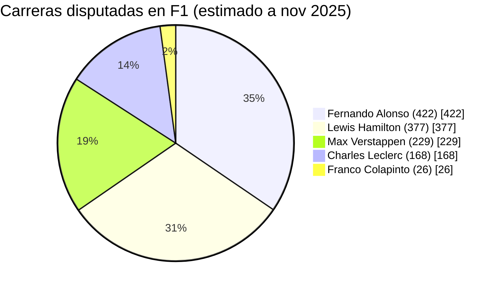

# Clase Tres - 11 de Noviembre 2025

# Repaso

* LLM
  * Propietarios
    * ChatGPT
    * Gemini
    * Claude
    * Perplexity
    * Grok
  * Open Source
    * Groq (Motor de Inferencia)
    * Llama
    * Qwen
    * Deepseeek
    * Mistral
* LMArena
* Hugging Face
  * Spaces de Hugging Face
* Ejecutar LLM Localmente
  * LMStudio
  * Ollama

# Prompt Engineering

## Patrones de Prompting

- ### Patron Rol o Persona

Sin el patron:
```
Quiero vender mi Fiat 500 por internet. Redactame el posteo para ofrecerlo y venderlo.
```

Aplicando el patron persona:
```
Actua como un experto en marketing especialista en autos clasicos. Quiero vender mi Fiat 500 por internet. Redactame el posteo para ofrecerlo y venderlo.
```

Aplicando el patron persona como una persona:
```
Actua como Franco Colapinto. Quiero vender mi Fiat 500 por internet. Redactame el posteo para ofrecerlo y venderlo.
```
Ejemplos del patron persona
> https://github.com/f/awesome-chatgpt-prompts
> https://github.com/estebancalabria/Intro-Ia/tree/main/Prompt%20Engineering/Patrones%20de%20Prompting/Persona


- ### Patron Interaccion

Aplicando tambien el patron de interaccion
```
Actua como un experto nutricionista especialista en las ultimas tendencias de comidas saludables y suplementos nutricionales y quiero que me armes mi plan de alimentacion de la semana. Quiero que me hagas preguntas DE A UNA con repuestas cortas para tener toda la informacion necesaria para armarme el plan optimo. Una vez que tengas toda la informacion armame el plan Responder solamente lo solicitado como para copiar y pegar sin acotar nada mas.
```

- ### Personalizacion de Salida

Formatos de Salida para presetnar informacion

'''
Dame la lista de los mejores libros de stpehen king. Su titulo, anio, resumen trama corto, lista de personajes, ubicacion,
'''

* Tecnicos
   * XML y JSON
   * HTML
        * Sirve para generar PDFS
   * CSV (Comma Seppatated Values)
        * Para comunicarse desde y hacia excel
   * Plantilla Markdown

```markdown
# [Titulo]

**[Fecha de LAnzamiento]**

## Argumento

> [COMPLETAR EL ARGUMENTO DEL LIBRO]

## Personajes

* [Personaje 1]
* [Personaje 2]
...
* [Personaje N]

## Informacion
* Ubicacion Trama : [UBICACION TRAMA]
* Cantidad Capitulos : [CANTIDAD PALABRAS]
* Puntuacion Critica : [Puntuacion de 1 a 5]
---
```

* Generacion de Diagramas
  * Mermaid
     * https://mermaid.live/

Prompt mermaid en Claude
```
Armame un artfacto mermaid que se visualize en un diagrama de flujo el organigrama de Google.  Que tenga a lo sumo 4 nodos por nivel. En lo posible con los nombres de cada uno
```

Prompt mermaid en ChatGPT
```
Armame un diagrama de pie mermaid que muestre las carreras de 5 corredores reconocidos incluyendo Colapinto. Buscar la informacion que haga falta
```
Me genero



- ## Tips de Prompt engineerign
* Ofrecer Recomensas
* Responder solamente lo solicitado como para copiar y pegar sin acotar nada mas.

# Gems

Gemini te permite crear tus propios GEMS y cargarle tanto documentos como informacion personalizada.

# Fine tunning de modelos

> https://www.youtube.com/watch?v=bIZMgHK8Y-8

