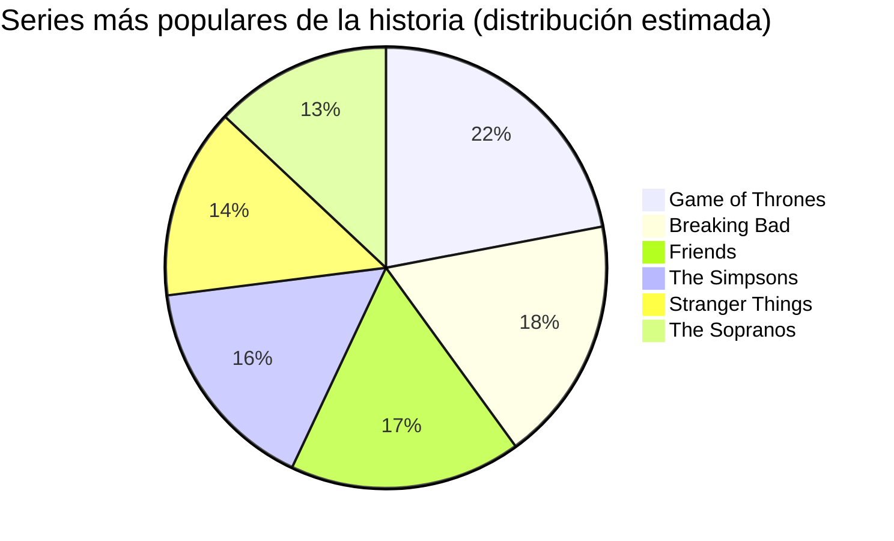

# Clase Cuatro - 26 de Diciebre 2026

# Repaso

* Large Laguage Models
    * Mistral
    * LMarena 
* Prompt Engineering
    * Receta de prompts Efectivos : https://www.instagram.com/p/C5MDsQiR5cG/?img_index=1
    * Patrones de Prompting
        * Persona / Rol
        * Interaccion
        * Personalizacion de Salida
          * json
                * JSON Prompting: https://www.youtube.com/watch?v=GNNUdlG22ZA&t=198s
          * xml
          * html  >>> Para generar PDFs
* Open Source
  * Hugging Face
      * Spaces
  * LMStudio

# Prompt Engineering

- ## Personalizacion de Salida : CSV (Cooma Separated Values)

* Me permite representar como texto una planilla de calculos
* Tanto excel como Google Sheets interpretan de forma nativa

```
Haceme una lista de 10 series de estreno para el 2026 . Quiero nombre. Temporada. Actore Prinicipal, plataforma, genero, resumen argumento, fecha planeada estreno.
```

* Pasamos la lista a csv

```
Dame la lista en formato csv
```

* El contenido generado por el LLM lo guardo en un archivo con extension .csv
* Creo un documento de google sheets en : https://sheets.google.com/
  * File...Import...Upload...Replace Current Sheet

- ## Personalizacion de Salida : Plantillas con Markdown 

* Permite definir una plantilla con el formato exacto en el quiero la salida
* Aumenta determinismo de la IA
* Markdown : https://es.wikipedia.org/wiki/Markdown
* Ejemplo de plantilla mardkdown
* Te ahorra horas de formateo a mano

```
# [Titulo Serie]

## Informacion

* **Plataforma** : [PLATAFORMA DONDE SE EMITE]
* **Fecha** : [FECHA DE RELEASE]
* **Genero** : [GENERO DE LA SERIE]
* **Temporadas** : [CANTIDAD TEMPORADAS]

## Actores

* Actor 1
* Actor 2
* ...
* Actor N

## Argumento

> [ARGUMENTO SERIE]

---
```
* El prompt completo
```
Devolveme las series utilizando esta plantilla "
# [Titulo Serie]

## Informacion

* **Plataforma** : [PLATAFORMA DONDE SE EMITE]
* **Fecha** : [FECHA DE RELEASE]
* **Genero** : [GENERO DE LA SERIE]
* **Temporadas** : [CANTIDAD TEMPORADAS]

## Actores

* Actor 1
* Actor 2
* ...
* Actor N

## Argumento

> [ARGUMENTO SERIE]

---" devolveme la lista para copiar y pegar sin acotar nada mas
```
* Se puede poner en un google docs aca : https://docs.google.com/

# Personalizaciond de Salida : Mer
maid

*  https://mermaid.live/
*  Ideal para utilizar con Claude

* En ChatGPT
```
Generame un diagrama de pie en mermaid con las 6 series de mas populares de toda la historia distribuidas por popularidad
```

* Me genera esto



* Lo probamos en Claude con sus artefactor

- ## Personalizacion de Salida : Codigo Fuente

* https://colab.google/
* https://matplotlib.org/
* https://matplotlib.org/stable/gallery/index

```
Me podes generar un codigo en python que use matplotlib para mostar un "stacked bar chard" que muestre el pbi de la argentina discbiminado por mayores y menores de 30 los ultimos 5 anios
```

* Esto me genero este codigo

```python
import matplotlib.pyplot as plt

# Años
years = ['2020', '2021', '2022', '2023', '2024']

# PBI estimado (valores ficticios, en miles de millones de USD)
pbi_under_30 = [150, 160, 170, 175, 180]
pbi_over_30 = [350, 370, 390, 405, 420]

# Crear el gráfico
plt.figure(figsize=(10, 6))

plt.bar(years, pbi_under_30, label='Menores de 30')
plt.bar(years, pbi_over_30, bottom=pbi_under_30, label='Mayores de 30')

# Etiquetas y título
plt.title('PBI de Argentina por grupo etario (estimado)')
plt.xlabel('Año')
plt.ylabel('PBI (miles de millones USD)')
plt.legend()

# Mostrar valores en las barras (opcional)
for i in range(len(years)):
    total = pbi_under_30[i] + pbi_over_30[i]
    plt.text(i, total + 5, str(total), ha='center')

plt.tight_layout()
plt.show()

```

* Lo previsualizo en Colab

# Herramientas de Productividad

- ## Notebook LM (La herramienta del momento)

* Le cargo algunos documentos y me arma un espacio de trabajo para interactuar con los mismos
* Examenes
* Infografias
* Resumenes de Audio
* Resumenes de Video
* Presentaciones tipo ppt

> https://notebooklm.google.com/

* Puntaje : 10 / 10

- ## Convertir Video/Audio/Reunion -> Texto : Taqtiv

* Hay Varias Herramientas : https://www.instagram.com/p/DBzb-kHxqae/?img_index=1
* https://tactiq.io/es

* Puntaje : 10 / 10

- ## Convetir Youtube -> Texto : Generador de Transcripciones sin Limite para YouTube

* https://chromewebstore.google.com/detail/unlimited-summary-generat/eelolnalmpdjemddgmpnmobdhnglfpje
* Puntaje :  10 / 10

  
