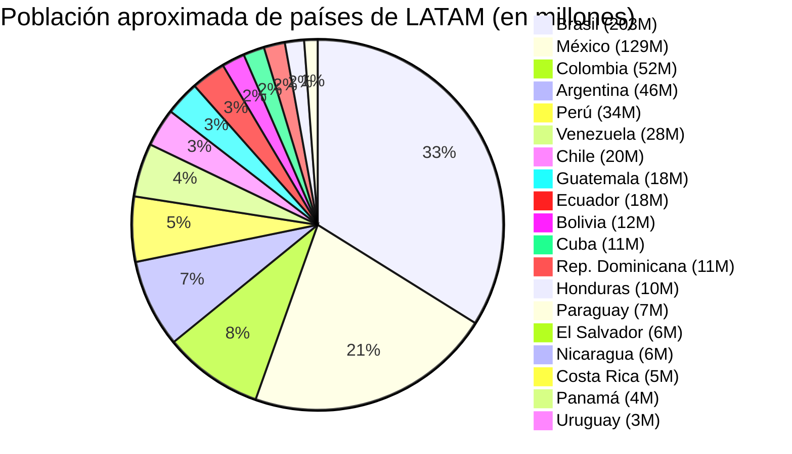

# Clase Cuatro - 19 de Febrero 2026

# Repaso

* Large Language Models
* Open Source
    * Hugging Face
      * https://huggingface.co/spaces
    * LMStudio
      * Los modelos Se bajan de Hugging Face
      * Modelos Open Source como : gemma4b,gwen4bthink,qwen4b,qwen8b
* Etica e IA
* Prompt Engineering
  * Formula Magica de Prompts : https://www.instagram.com/p/C5MDsQiR5cG/?img_index=1
  * Patrones de Prompting
    * Rol / Persona

# Large Language Models

## Groq (Con q)

* Motor de Inferencia para ejecutar modelos Open Source Online
* https://groq.com/
* https://chat.groq.com/

## Comparar modelos de Lenguaje

* LmArena
   * https://arena.ai/

# Prompt Engieering

## Interaccion (Contexto)

* Consiste en hacer que la IA me haga preguntas pertinentes como contexto de la conversacion para dar respuestas mas puntuales
  * Sin Interaccion : "Quiero que planifiques una rutina de ejercicios como si fueras mi personal trainner?"
  * Con Interaccion : "Quiero que planifiques una rutina de ejercicios como si fueras mi personal trainner?. Quiero que me hagas preguntas DE A UNA para determinar la rutina de ejercicios optima para mi persona"

## Formato de Salida

Para este patron pedimos una lista de algo

```
Haceme una lista de alimentos saludables. Nombre, origen, calorias, nutrientes,  beneficios
```

* Tecnicos
  * JSON : Formato tecnico para desarrolladores u otros programas.
  * XML : eXtensive Markup Language
* HTML
   * Sirve para exportar a pdf : "Quiero generar la lista como html en un formato moderno y elegante como para exportar a pdf"
* Markdown
  * https://es.wikipedia.org/wiki/Markdown
  * Vamos a hacer una plantilla markdown para la lista de alimentos
* CSV : Comma Separated Values
   * Para exportar un texto a excel o a google Sheets
* Diagramas
   * Mermaid
      * Se lleva muy bien con Claude
         * "Generame un artefacto que muestre en un diagrama de pie mermaid el top 5 de productos que exporta canada a USA."
      * Haceme un diagrama mermaid de pie con la poblacion de los paises de LATAM

## Markdown para formato de Salida
   
```
# [ALIMENTO]

## Caracteristicas

* Origen : [Origen del Alimento]
* Descripcion : [Descripcion del alimento]
* Calorias : [Calorias del lalimenots]


## Nutrienes

* [Nutriente 1]
* [Nutriente 2]
...
* [Nutriente N]

## Beneficios

* [Beneficio 1]
* [Beneficio 2]
...
* [Beneficio N]

## Cita

> [Cita sobre el alimento de alguien famoso]

```

Prompt

```
Me podes generar lista de acuerdo a la siguiente plantilla markdown "
# [ALIMENTO]

##
Caracteristicas

* Origen : [Origen del Alimento]
* Descripcion : [Descripcion del alimento]
* Calorias : [Calorias del lalimenots]


## Nutrienes

* [Nutriente 1]
* [Nutriente 2]
...
* [Nutriente N]

## Beneficios

* [Beneficio 1]
* [Beneficio 2]
...
* [Beneficio N]

## Cita

> [Cita sobre el alimento de alguien famoso] "

Solamente la lista sin acotar nada mas.

```

## Mermaid (para la generacion de diagramas)

> https://mermaid.live/

* Con ChatGPT Generamos a partir de este prompt : "Haceme un diagrama mermaid de pie con la poblacion de los paises de LATAM"



# Herramienta : Napkin

* Permite a partir de un texto enriquecerlo con diagramas generados con IA

> https://www.napkin.ai/

* Puntaje : 10/10

