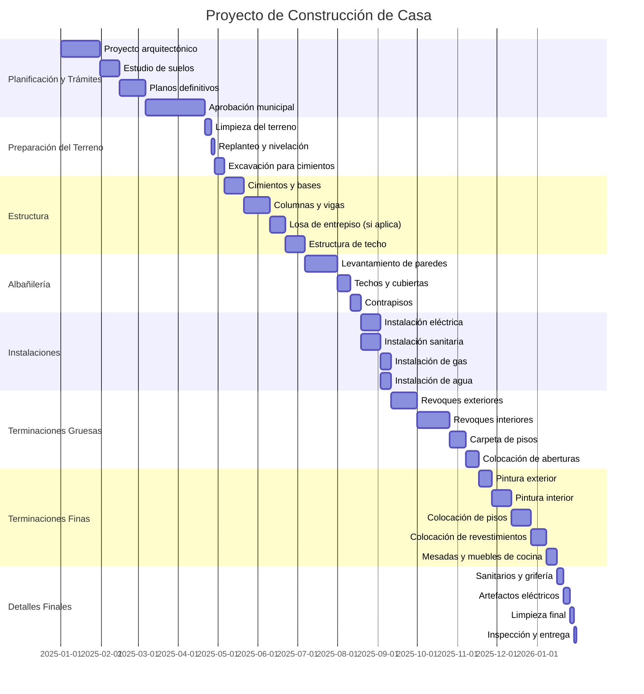

# Clase Tres - 28 de Noviembre del 2025

# Repaso 

* LLM
  * LLM Propietarios
    * ChatGPT
    * Gemini
    * Grok
    * Perplexity  << Para investigacion con Citas
  * LLM Open Source
    * Los Modelos Open Source Se suben a Hugging Face y te lo podes bajar
        * **IMPORTANTE: LOS SPACES : https://huggingface.co/spaces**
    * Para ejecutar un modelo Open Source Localmete
        * LMStudio
        * Ollama
    * Mistral (FRACIA SEGUNDO)
    * Groq
      * https://chat.groq.com/
    * Familia LLama
    * Chinos
      * Qwen
      * DeepSeek
* Comparar LLM
  * LMArena
* Prompt Engineering
  * Patron Persona

# Prompt Engineering

> Explicacion General + Super Formula : https://www.instagram.com/p/C5MDsQiR5cG/?img_index=1

- ## Patron Persona / Rol

* Abri 3 Solapas de Chrome con ChatGPT
* Vamos a hacer el mismo prompt
   * Directo

```
 "Dame consejos para dormir mejor"
```

   * Preguntandole a un Rol especifico

```
"Actua como un especialista en suenio, somnologo medio profesional y buenos habitos y dame tips fundamentados de como lograr una mejor salud del suenio."
```

* Preguntandole a una persona especifica
```
 "Actua como Lili suyos y dame consejos para dormir mejor"
```

> Pueden explorar muchos ejemplos del patron Persona en : https://github.com/f/awesome-chatgpt-prompts

- ## Contexto : Patron Interaccion

"Quiero que me hagas preguntas DE A UNA POR VEZ para..." (A veces le agrego que me haga preguntas de respuestas cortas)

Ejemplo

```
Actua como un especialista en suenio, somnologo medio profesional y buenos habitos y dame tips fundamentados de como lograr una mejor salud del suenio personalizada para mi. Quiero que me hagas preguntas DE A UNA POR VEZ para conocerme y hacerme el mejor plan de suenio adapatado a mi vida. Haceme todas las pregutnas que consideres necesarias para obtener el mejor plan de suenio optimo adaptado a mi persona
```

Ejemplo (De Soledad)

```
Actua como el mejor especialista en comunicacion organizacional y dame consejos fundamentales de como lograr la mejor comunicacion dentro de la empresa como especialista en rrhh. QUiero que me hagas una pregunta a la vez para conocer la empresa y obtner el mejor plan de comunicacion dentro de la empresa
```

Tips de Contexto
* Nuevo tema, Nueva conversacion
* Guardar conversaciones frecuentes para no tener que repetir todo el contexto

# Formato : Personalizacion de Salida

* Formatos de Salida
   * Sin Formato : "Dame una lista de las 10 mejores series policiales"
   * Tecnicos
      * json
      * XML
      * TOON
   * Tecnico / Exportar a PDF
      * HTML : "Dame la lista en html en un formato profesional para luego generar un pdf"
   * Tecnico / Interactuar con Excel o Google sheets
      * CSV (Comma Separated Values) : Dame la lista como un CSV
         * Este es un formato MUY importante porque me permite interactuar desde y hacia excel
   * Markdown
      * https://es.wikipedia.org/wiki/Markdown
      * Plantilla MArkdown para especificar EXACTAMENTE como queremos la salida
```
---

# [TITULO]

## Detalles

* **Genero** : [GENERO DE LA SERIE]
* **Año** : [AñO DE LA SERIE]
* **Plataforma** : [PLATAFORMA PRINCIPAL]

## PORQUE VERLA

> [TRAMA DE LA SERIE]

## ACTORES PRINCIPALES

1. [ACTOR 1]
2. [ACTOR 2]
...
N. [ACTOR N]

---
```      
      
 * Mermaid
    * https://mermaid.live/
    * Ideal para usarlo en Claude

```
Armame un mermaid que muestre un diagrama de pie que muestre el presupuesto de cada una de las series
```

Salida


Me compre un terreno y quiero hacer una casa. Armame un artefacto con mermaid el Gant de todo el proyecto hasta que este la casa terminada...
```


