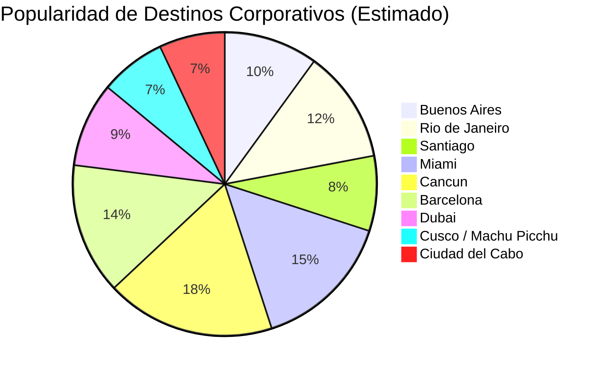

# Clase Cuatro - 30 de Marzo del 2021

# Repaso

* Large Language Models
  * Comparar Modelos
      * LMArena
  *  Open Source
      * Huggign Face
          * Repositorio de Modelos Open Source
          * Spaces para probar modelos libres
* Prompt Engineerign
  * Formula para armar prompts
      * Objetivo/Tarea + Contexto (Prompt + Conversacion + Memoria[ChatGPT.,,) + Conversarciones Pasadas + ...) + Rol + Fomato + Tono + Ejemplos
  * Patrones de Prompting
      * Persona / Rol
      * Interaccion / Prompt Chainning

# Large Language Modelos

* Claude 
    * Es bueno para el analisis de datos
    * Hacer Reportes
    * Hacer aplicaciones con dashboards visuales
    * Hacer un codigo con un programa/pagina web que te resuelva el problea


# Prompt Engineering

## Personalizacion de Salida

* Primero le vamos a pedir una lista de algo a la IA con sus datos relacionados

```
Dame una lista destinos turisticos para organizar viajes corportativos. Dame el destino, el pais, la epoca del año para viajar, el costo (Bajo, medio, elevado, exclusivo), la infraestructura hotelera (alta/media/baja), Companias aereas que lleguen, Necesita Visa, Requerimientos de Salud (Vacunas, etc) .
```

## Formatos de Salida

### Formatos Tecnicos

     * JSON / XML
        * Generalmente son formatos que usan los devs o aplicaciones que te piden la informacion en JSON para importar
    * Formatos de Presentacion
        * HTML
            * Util para exportarlo a PDF
               * "Me podes generar esta lista en un html que se sea profesional y corporativo para mandar a un cliente con las opciones para ellos elijan"
               * Cuando lo exporto a pdf no salen bien los colores y ademas las tablas me quedan cortadas por la mitad. podes corregirlo

### Formatos para hojas de calculo
    
      * CSV
         * Si tenes excel instalado lo abre directamente
         * Sino lo abro con google sheets
    * Interaccion con formatos Estandar
       * Ahora se lo puedo pedir como Excel 
       * Se lo puedo pedir como ppt
       * Esto en ChatGPT es bastante nuevo

### Formatos para pasar a Texto

       * Muchas veces al copiar lo que genera el LLM a Word, gane mucho tiempo en generacion de contenido pero le tengo que dedicar tiempo a ajustarlo al formato que quiero (titulo, negritas, etc...)
       * Markdown
         * https://es.wikipedia.org/wiki/Markdown
       * Con Markdown Armo una plantilla
         * Para el prompt le paso a ChatGPT la plantilla exacta como quiero la informacion
 
```
# [Destino]

## Datos Generales

* Pais : **[Pais del Destino]**
* Epoca ideal : [Epoca Ideal del destino]
* Costo : [Costo del destino]

## Requerimientos

1. el costo : (Bajo, medio, elevado, exclusivo), 
2. la infraestructura hotelera :  (alta/media/baja), 
3. Companias aereas que lleguen
     * Compania 1
     * Compania 2
     *. ..
4. Necesita Visa : 
5. Requerimientos de Salud : (Vacunas, etc)
 
## Detalle

> [Una cita que explique porque este destino es ideal]

---
```

### Generacion de Diagramas y Graficos (Mermaid)

* Mermaid
  * https://mermaid.live/
  * "Con los destinos que vimos generame un diagrama memaid de pie que muestre el indice de turismo/popularidad de cada uno de los destinos" 


         
    


# CAsos de uso a realizar

* A partir de un excel generar un ppt

# Glosario

* La IA no es deterministica
