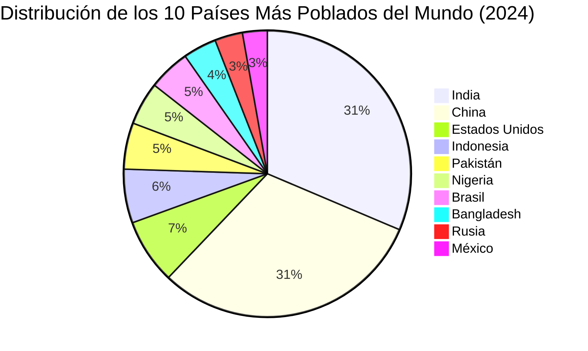

# Prompt Engineering

## Conceptos de Prompt Engineering (Repaso)
* System Prompt
* Contexto
* Formula de Prompt Efectivo = Tarea + Contexto + Ejemplo + Persona + Fomato + Tono
* Memoria
* Personalizacion ChatGPT

## Patrones de Prompting (Repaso)
* Persona
* Audicence Persona
* Interaccion
* Personalizacion de Salidas (Formatos)
   *  bullets
   *  Json
   *  XML
   *  html
   *  CSV -->  Integracion con Excel)

### Patron Personalizacion de Salida : Markdown

Prompt Inicia
> Dame una lista de 10 paises que debo visitar antes de morir

Prompt Mejorado
> Dame la lista respetando la siguiente plantilla markdown
Plantilla
```markdown
# [Nombre Del Pais]
## Datos
* **Capital** : [CAPITAL]
* **Poblacion** : [POBLACION DEL PAIS]
* **Idioma** : [Idioma del pais]
* **Moneda** : [Moneda del pais]
## 5 Lugares de Interes
1. [Lugat de Interes 1]
2. [Lugat de Interes 2]
...
## Descripcion
[ Descripcion porque debo de conocerlo ]
---
```

### Patron Personalizacion de Salida : Mermaid

Previsualizador de Mermaid
> https://mermaid.live/

Prompt Usado
>Me armas un diagrama pie mermaid con la distribucion de los 10 paise mas poblados del mundo?
Mermaid Generado


# Herramienta nueva de IA (Contexto)

Una de las mejores herramientas que vamos a ver"
> https://notebooklm.google.com/

   
Me sirve para ejemplificar todo el tema del contexto de los llm
No olvidarse de generar un podcast!!


