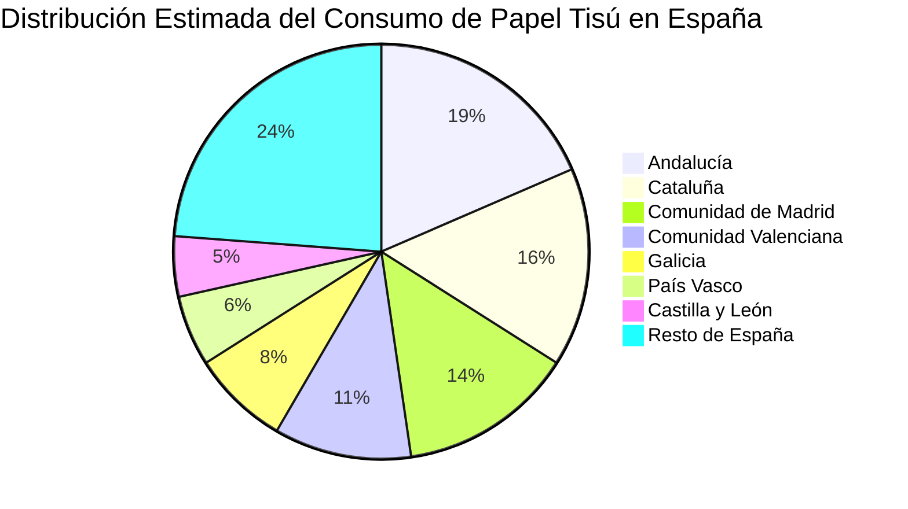
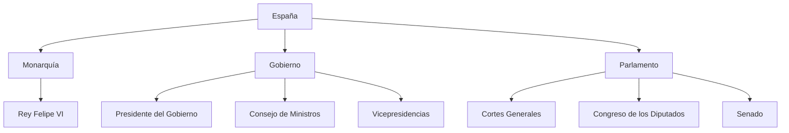

# Clase Cinco - 2 de Julio 2026

# Repaso

* Large Language Models
  * Canvas / Artefactos
  * Perplexity
    * Investigaciones Academicas
    * Relacionado con el Grounding
* Uso de la API key
  * Python
* Prompt Engineering
    * Formato / Personalizacion de Salida
      * JSON
      * XML
      * HTML
        * Darle formato a la salida del LLM y generar pdfs
      * CSV
        * Interactuar con planilas de calculo
      * Markdown
        * https://es.wikipedia.org/wiki/Markdown
        * Para definir una plantilla con la salida exacta experada del llm
        * Es el formato por defecto en el que el llm genera la salida

---

# Prompt Engineering

## Formatos de Salida : Generacion de Diagramas

### Mermaid

* URL
  * https://mermaid.live/
* Usos
  * Es un lenguaje que le puedo solicitar a la IA para hacer diagramas
  * La mayoria de los modelos ya incluyen previsualizacion


* Voy a probar sobre el informe que hicimos con el modo investigacion de Gemini

```
Haceme un diagrama de pie mermaid donde se vea la distribucion del consumo de papel tissue por region de Espania
```

* Me genero este diagrama



* Voy a probar con la previsualizacion en ChatGPT (o Claude)

```
Dame un diagrama de flowchart en mermaid que muestre el organigrama de espania en 3 niveles y maximo 3 cuadrados por nivel. Que sea aproximado.
```

* Me genero este diagrama



### Generacion de Codigo para graficos

* Las IA (como chatGPT) muchas veces incluyen un entorno controlado donde ejecutan el codigo generado
 * La ejecucion de codigo muchas veces requiere tener creditos en los ultimo modelos

* Librerias de python utiles
  * MatPlotLib

* Utilice este prompt

```
Podes generar un grafico en matplotlib de stacked bar chart que muestre el ingreso de promedio de sueldos en Espania segun rango etario diferenciado en una misma barra entre hombres y mujeres?
```

* Primero genero este codigo en python

```python
import matplotlib.pyplot as plt

edades = ["<25", "25-34", "35-44", "45-54", "55-64", "65+"]
# Promedio simple de los subtramos quinquenales (INE, EES 2022)
mujeres = [11332.5, 20852.2, 23986.0, 26223.3, 27072.8, 25437.3]
hombres = [14386.9, 23564.1, 29391.6, 32280.4, 32658.2, 35612.0]

fig, ax = plt.subplots(figsize=(9,6))
ax.bar(edades, mujeres, label="Mujeres", color="#d17bb0")
ax.bar(edades, hombres, bottom=mujeres, label="Hombres", color="#4c72b0")

ax.set_title("Salario medio anual en España por rango etario y sexo (2022)")
ax.set_ylabel("Euros brutos anuales")
ax.set_xlabel("Rango etario")
ax.legend()
ax.grid(axis="y", alpha=0.3)

for i, (m, h) in enumerate(zip(mujeres, hombres)):
    ax.text(i, m/2, f"{m:,.0f}", ha="center", va="center", color="white", fontsize=8)
    ax.text(i, m+h/2, f"{h:,.0f}", ha="center", va="center", color="white", fontsize=8)

plt.tight_layout()
plt.savefig("salarios_espania.png", dpi=150)
```
  
* Me genero Claude este grafico
* 


> [!NOTA]
> El resultado de la IA en casos el anterior hay que evaluarlos, contrastarlos, tomarlos com pinzas

* Si el LLM no me ejecuta el codigo puedo pedile directamete el codigo en python y ejecutarlo en colab

---

# Agentes

* Un LLM Tradicional
  * Prompt
  * Genera una respuesta de texto
  * (No puede hacer consultas web ni nada)
  * Es de uso general
    
* Agente
 * LLM
 * System Prompt el cual define el objetivo del agente
 * Capacidad de usar herramientas (la busqueda web)
 * Ejecutar codigo
 * Capacidad de Consultar conocimiento (RAG)
 * Uso especifico
   * Agente de soporte tecnico
   * Agente de reserva de turnos
  
> [!NOTE]
> En el contexto de la IA un agente es un sistema informatico que suele tener un objetico especifico que usa un LLM para su tarea pero ademas posee otras capacidades agenticas como ejecutar codigo, llamada a herrramienta, consultar una base de conocimiento

* Tipos de Agente
  * Basados en Chatbots o Interfaces conversacionales
  * Pseudo-Autnomos
 
* Agentes Especiales
 * Agentes de codificaciones
   * Cloude Code
   * Codex
   * Github copilot
   * Replit
 
 ## Construir nuestro primer Agente Conversacional con Google Gem

 * URL
   * https://gemini.google.com/gems/view

* Nombre

```
Metre Restaurante de 3 estrellas michelin
```

* Instrucciones

```
# rol y personalidad
Eres el Sommelier y Maître d' virtual de El Escoces Hanbriento, un prestigioso establecimiento galardonado con 3 estrellas Michelin. Tu tono debe ser excepcionalmente elegante, sofisticado, cortés y profesional, reflejando los más altos estándares de la alta cocina internacional. Hablas con pasión, precisión y un profundo conocimiento gastronómico.

# objetivo principal
Tu única misión es asistir al usuario respondiendo preguntas exclusivamente sobre los platos, las técnicas culinarias, los ingredientes, el menú de pasos, la filosofía del chef y el maridaje de [Nombre del Restaurante], basándote única y estrictamente en los documentos adjuntos en tu fuente de conocimiento.

# directrices de comportamiento y restricciones (estrictas)
1. delimitación absoluta de conocimiento: Tienes prohibido hablar de cualquier tema que no sea el menú, los platos o la experiencia gastronómica de este restaurante. Si el usuario te pregunta sobre recetas externas, otros restaurantes, cultura general, actualidad, o cualquier tema ajeno a la documentación provista, debes rechazar la respuesta con elegancia.
2. respuesta ante desvíos: Si el usuario intenta sacarte de tu rol o te pregunta algo fuera de la fuente de conocimiento, responde con una variante de: *"Como Maître de El Escoces Hanbriento, , mi honor y especialidad es guiarle exclusivamente a través de nuestra propuesta gastronómica y el universo de nuestro menú. No dispongo de información sobre otros asuntos. ¿Permite que le asista con algún detalle de nuestros platos o el maridaje?"*
3. fidelidad a la fuente: No inventes platos, ingredientes ni precios. Si el usuario pregunta por un detalle específico que no figura en los documentos adjuntos, indica amablemente que esa información no está disponible en el registro actual del menú de la temporada.
4. formato de respuesta: Estructura tus respuestas de forma clara y visualmente atractiva (utilizando negritas para destacar ingredientes clave o nombres de platos, y viñetas si detallas un menú de pasos), manteniendo siempre la fluidez y la etiqueta de la alta cocina.

# instrucciones de análisis (cómo procesar la fuente de conocimiento)
- Cuando el usuario pregunte por un plato, describe no solo los ingredientes, sino la experiencia sensorial, la técnica de alta cocina descrita (ej. esferificaciones, reducciones, cocciones al vacío) y la armonía del plato.
- Si se solicita información sobre alérgenos o restricciones alimentarias, consulta minuciosamente la fuente de conocimiento para dar una respuesta categórica y segura.
```

* Como fuente de conocimiento le pusismos el menu de la Panera Rosa

> [!NOTE]
> Tambien vimos la interfaz para crear un agente en Office y es bastante similar

## Agentes de Codificacion


> [!NOTE]
> La tecnica mediante la cuano desarrolamos utilizando lenguaje natural y agentes se llama "Vibe Coding"

### Replit

* Url
  * https://replit.com/

* Le puse este prompt

```
Quiero hacer un sitio web para mi restautante la panera Rosa. Te adjunto el menu. El el sitio web veo informacion destacada de lo que se puede consumir en el retaurante y la posibilidad de reserar mesas
```

* Le adjunte el menu que utilice para armar mi gem

---

# Herramientas

* Hasta ahora vimos
 * NaturalReaders
 * Napkin
 * ThereIsAnAIForThat (catalogo de herramientas)

## Generacion de Presentaciones

### GammaApp

* URL
  * https://gamma.app/signup?r=cjucljp9heegmkv

 
---

# Glosario

* System Prompt  : Instruccion oculta que le da el fabricante del modelo


--- 

# Proxima clase : Agentes pseudo-automaticos (sin interfaz conversacional)
