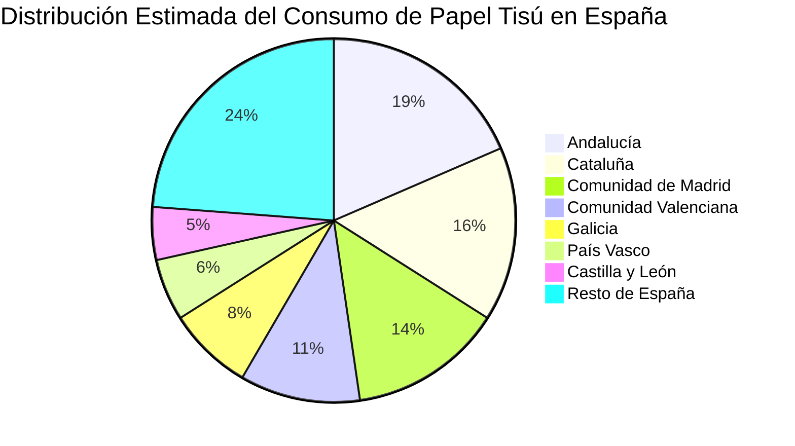

# Clase Cinco - 2 de Julio 2026

# Repaso

* Large Language Models
  * Canvas / Artefactos
  * Perplexity
    * Investigaciones Academicas
    * Relacionado con el Grounding
* Uso de la API key
  * Python
* Prompt Engineering
    * Formato / Personalizacion de Salida
      * JSON
      * XML
      * HTML
        * Darle formato a la salida del LLM y generar pdfs
      * CSV
        * Interactuar con planilas de calculo
      * Markdown
        * https://es.wikipedia.org/wiki/Markdown
        * Para definir una plantilla con la salida exacta experada del llm
        * Es el formato por defecto en el que el llm genera la salida

---

# Prompt Engineering

## Formatos de Salida : Generacion de Diagramas

### Mermaid

* URL
  * https://mermaid.live/
* Usos
  * Es un lenguaje que le puedo solicitar a la IA para hacer diagramas
  * La mayoria de los modelos ya incluyen previsualizacion


* Voy a probar sobre el informe que hicimos con el modo investigacion de Gemini

```
Haceme un diagrama de pie mermaid donde se vea la distribucion del consumo de papel tissue por region de Espania
```

* Me genero este diagrama


