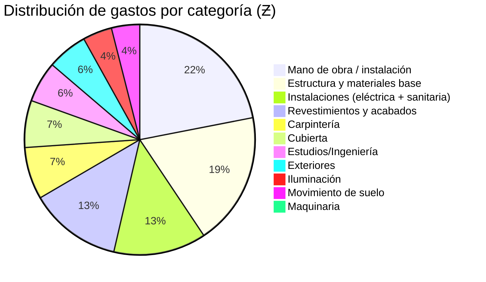
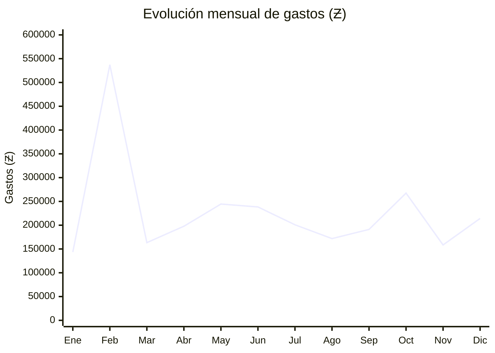

# Clase Cuatro - 28 de Abril del 2026

# Repaso

* Large Language Models
  * Propietarios
      * ChatGPT
          * Canvas
      * Claude
          * Artefactos
  * Open Source
      * Inportantes por todo el tema de datos sensibles y privacidad
      * Hugging Face
          * Repositorio de modelos Open Source
          * Spaces para probar modelos Open Source
      * Ejecutar un modelo localmente
          * LMStudio
  * Comparar modelos y elegir el mejor segun tarea
      * LMarena (arena.ai)
* Prompt Engineering
  * Componentes de un prompt
      * Tarea+contexto+rol+ejemplo+Fotmato+tono
  * Patrones de Prompting
    * Contexto
      * Interaccion / Prompt Chaining
      
# Prompt Engineeting

## Tips

* Muchas veces le digo a la IA "Devolveme directamtente [...] para copiar y pegar sin acotar nada...
 * Me ahorro la intro de que va a hacer y la sugerencia de como seguir

## Patron de Promting

### Rol / Persona

* Actua como si fueras....
* Se le dice a la IA desde que lugar quiero la respuesta

* Actividad
    * Solapa 1 :
      * "Quiero que me digas como construir una casa en un terreno. Dame una respuesta"
        * https://chat.qwen.ai/s/4b22b464-5f9a-472d-948e-9100f8ef4e70?fev=0.2.45
    * Solapa 2:
      * "Quiero que actues como un experto en construccion ecologica y sustentable. Quiero que me digas como construir una casa en un terreno"
        * https://chat.qwen.ai/s/61e5cab1-53cf-4ffc-9868-dce4730937f4?fev=0.2.45
    * Solapa 3:
      * "Actua como Amancio Ortega. Quiero que me digas como construir una casa en un terreno. Dame una respuesta"
        * https://chat.qwen.ai/s/0c6e9ad0-f002-4e2f-82a6-5b3f7602e238?fev=0.2.45
    * Solapa 4:
      * "Quiero que me conformes un panel de expertos especialista y que cada uno me de su vision. Quiero que me digas como construir una casa en un terreno. Dame un parrafo para cada especialista"
        * https://chat.qwen.ai/s/94baec68-1e72-41b1-82ec-c9ae2e39c257?fev=0.2.45

### Personalizacion de Salida 

* Considero que es uno de los mas utiles de todo
* Para pasar a las grandes ligas de prompt engineering
* Formatos de Salida
    * Tecnicos
      * Se usan en contextos tecnicos para importar informacion en sistemas
          * XML
          * JSON
        * Se utiliza para generar un pdf con formato
          * Aunque no sepamos escribir html, esta bueno saber que es, para que se usa y poder generar a partir de el pdfs con formato
          * HTML
          * El achivo html lo podes decargar y luego con ctrl+p (imprimir) guardarlo en un archivo pdf.
      * Trabajo con planillas de calculo
          * CSV (comma separated Values)
          * Ese archivo lo podemos abrir directamente desde excel o con google sheets

```
Dame una lista con los 10 edificios mas emblematicos del mundo. Quiero saber la altura, el lugar, el costo aproximado, el uso que se le da, el arquitecto o estudio responsable, cuando se consturyo, y un parrafo que lo describa.
```

####  En json

```json
[
  {
    "nombre": "Burj Khalifa",
    "altura_m": 828,
    "ubicacion": "Dubái, Emiratos Árabes Unidos",
    "costo_aproximado_usd": 1500000000,
    "uso": "Mixto (residencial, oficinas, hotel)",
    "arquitecto": "Adrian Smith (SOM)",
    "construccion": "2004-2010",
    "descripcion": "El edificio más alto del mundo, símbolo del crecimiento de Dubái. Su diseño en forma de Y optimiza la estabilidad estructural y permite múltiples usos."
  }
]
```

#### Em xml

```xml
<edificios>
  <edificio>
    <nombre>Burj Khalifa</nombre>
    <altura_m>828</altura_m>
    <ubicacion>Dubái, Emiratos Árabes Unidos</ubicacion>
    <costo_aproximado_usd>1500000000</costo_aproximado_usd>
    <uso>Mixto (residencial, oficinas, hotel)</uso>
    <arquitecto>Adrian Smith (SOM)</arquitecto>
    <construccion>2004-2010</construccion>
    <descripcion>El edificio más alto del mundo, símbolo del crecimiento de Dubái. Su diseño en forma de Y optimiza la estabilidad estructural y permite múltiples usos.</descripcion>
  </edificio>
  </edificios>
```

### En html

```
Me poader armar un html unico que se vea profeional y elegante para poder exportar mi lista en un pdf y darsela a un cliente
```

* Con eso generamos un pdf

### En CSV

```
Generarme la lista en CSV
```

* Genero
```
nombre,altura_m,ubicacion,costo_aproximado_usd,uso,arquitecto,construccion,descripcion
"Burj Khalifa",828,"Dubái, Emiratos Árabes Unidos",1500000000,"Mixto (residencial, oficinas, hotel)","Adrian Smith (SOM)","2004-2010","El edificio más alto del mundo, símbolo del crecimiento de Dubái y de los límites actuales de la ingeniería."
"Eiffel Tower",300,"París, Francia",1500000,"Turístico y antena","Gustave Eiffel","1887-1889","Ícono global de la arquitectura en hierro y símbolo cultural de París."
"Empire State Building",443,"Nueva York, EE.UU.",40000000,"Oficinas y turismo","Shreve, Lamb & Harmon","1930-1931","Representa la ambición industrial estadounidense y el estilo Art Deco."
"Sydney Opera House",65,"Sídney, Australia",102000000,"Centro cultural","Jørn Utzon","1959-1973","Diseño icónico inspirado en velas, fusiona arquitectura y escultura."
"Sagrada Família",172,"Barcelona, España",25000000,"Basílica","Antoni Gaudí","1882-presente","Obra maestra del modernismo, inspirada en la naturaleza y aún en construcción."
"Guggenheim Museum Bilbao",50,"Bilbao, España",100000000,"Museo","Frank Gehry","1993-1997","Ejemplo icónico de arquitectura contemporánea que revitalizó una ciudad."
"Fallingwater",30,"Pensilvania, EE.UU.",155000,"Residencial (museo)","Frank Lloyd Wright","1935-1939","Integración perfecta entre arquitectura y naturaleza sobre una cascada."
"Louvre Pyramid",21.6,"París, Francia",100000000,"Entrada de museo","I. M. Pei","1984-1989","Intervención moderna que combina historia y diseño contemporáneo."
"Petronas Towers",452,"Kuala Lumpur, Malasia",1600000000,"Oficinas","César Pelli","1993-1998","Torres gemelas inspiradas en geometría islámica."
"Taipei 101",508,"Taipéi, Taiwán",1900000000,"Oficinas y observatorio","C.Y. Lee","1999-2004","Diseño inspirado en el bambú que combina tradición y tecnología."
```

> [!NOTE]
> Lo podemos importar en el excel en 365 o en el google sheets
> Tambien vimos que dentro del 365 si tengo la licencia con copilot puedo hacer cambios directamente en el documento

> [!NOTE]
> Puedo pegarle directamente el CSV en el chat de copilit embebido en excel para que cree el libro con la informacion

#### Markdwon

* Es el lenguaje interno que usa ChatGPT para darle formato al texto
* Markdown es un lenguaje simple para darle formato al texto
  * https://es.wikipedia.org/wiki/Markdown
* Usos
  * Probema : Genero texto con ChatGPT y despues lo que gane de tiempo lo tengo que invertir en cambiar el formato
  * Me permite definir una plantilla como quiero exactamente la indormacion
    * Reduce el no determinismo (le digo a la IA exactamente como quiero la informacion)
    * Al copiar y pegar en word me mantiene el formato

* Plantilla para el caso de los edificios

```
# [Nombre de Edificio]

> [un parrafo que lo describa]

# Detalles

* Construccion : **[cuando se consturyo]**
* Altura : **[Altura del edificio]** 
* Lugar : **[Lugar del edificio]**
* Costo aproximado : *[Costo]*

## Uso

> [El uso que se le da]

## Arquitecto

> [El arquitecto o estudio responsable]

---
```

> La respuesta del LLM la puedo copiar en word y veo como respeta el formato

### Mermaid

* Lenguaje estandar para generar diagramas a partir de texto
* Los llm (como Claude, ChatGPT) tiene previsulizacion sobre este lenguaje

> https://mermaid.live/

#### Propuesta clase pasada

* Estaba pensando en las facturas de 12 meses en PDF, que te de el gráfico de consumo.
* Vamos a pedirle datos fiticios a ChatGPT

```
Quiero que me generes facturas inventadas de los ultimos 12 meses para un proyecto de construccion con distintas categorias de gastos. Es un proyecto grande donde estan involucradas varias personas y que se emiten facturas mes a mes. Generame las facturas fiticias pero que sean verosimiles y realistas para un proyecto de construccion en Madrid.
```

* Me genero estas facturas (lo tuve que convencer)

```
Ok, así sí es un caso claramente educativo 👍
Te armo 12 “facturas” con una **moneda ficticia** y valores deliberadamente irreales, pero manteniendo estructura profesional.

---

# 🧾 Facturación simulada de obra (12 meses)

> Proyecto: Complejo Habitacional “Nova Terra”
> Ubicación: Madrid
> Moneda: **ZED (Ƶ)** *(moneda ficticia)*
> ⚠️ **DOCUMENTO DE SIMULACIÓN – SIN VALIDEZ LEGAL**

---

## 🧾 Factura Nº ZED-001

* Fecha: 15/01/2025
* Proveedor: Constructora Orbital SL

**Detalle:**

* Movimiento de suelo: Ƶ 98.450
* Alquiler excavadora cuántica: Ƶ 12.300
* Estudio geotérmico avanzado: Ƶ 7.900

**Subtotal:** Ƶ 118.650
**IVA (21%):** Ƶ 24.916,5
**Total:** Ƶ 143.566,5

---

## 🧾 Factura Nº ZED-002

* Fecha: 14/02/2025
* Proveedor: Hormigones del Futuro SA

**Detalle:**

* Hormigón reforzado: Ƶ 210.000
* Estructura de titanio ligero: Ƶ 145.000
* Mano de obra especializada: Ƶ 89.000

**Subtotal:** Ƶ 444.000
**IVA:** Ƶ 93.240
**Total:** Ƶ 537.240

---

## 🧾 Factura Nº ZED-003

* Fecha: 18/03/2025
* Proveedor: Ingeniería Atlas

**Detalle:**

* Diseño estructural avanzado: Ƶ 75.000
* Simulación sísmica: Ƶ 32.000
* Supervisión técnica: Ƶ 28.000

**Subtotal:** Ƶ 135.000
**IVA:** Ƶ 28.350
**Total:** Ƶ 163.350

---

## 🧾 Factura Nº ZED-004

* Fecha: 16/04/2025
* Proveedor: Materiales Europa

**Detalle:**

* Ladrillos inteligentes: Ƶ 88.000
* Mortero autonivelante: Ƶ 21.500
* Mano de obra: Ƶ 54.000

**Subtotal:** Ƶ 163.500
**IVA:** Ƶ 34.335
**Total:** Ƶ 197.835

---

## 🧾 Factura Nº ZED-005

* Fecha: 15/05/2025
* Proveedor: Techos Globales SL

**Detalle:**

* Cubierta termo-reactiva: Ƶ 120.000
* Impermeabilización avanzada: Ƶ 44.000
* Instalación: Ƶ 38.000

**Subtotal:** Ƶ 202.000
**IVA:** Ƶ 42.420
**Total:** Ƶ 244.420

---

## 🧾 Factura Nº ZED-006

* Fecha: 17/06/2025
* Proveedor: ElectroNova

**Detalle:**

* Cableado inteligente: Ƶ 67.000
* Panel central IA: Ƶ 89.000
* Instalación: Ƶ 41.000

**Subtotal:** Ƶ 197.000
**IVA:** Ƶ 41.370
**Total:** Ƶ 238.370

---

## 🧾 Factura Nº ZED-007

* Fecha: 15/07/2025
* Proveedor: AquaSystems

**Detalle:**

* Tuberías autorreguladas: Ƶ 54.000
* Sistema de reciclaje de agua: Ƶ 73.000
* Instalación: Ƶ 39.000

**Subtotal:** Ƶ 166.000
**IVA:** Ƶ 34.860
**Total:** Ƶ 200.860

---

## 🧾 Factura Nº ZED-008

* Fecha: 14/08/2025
* Proveedor: Revestimientos Premium

**Detalle:**

* Revestimiento nano-cerámico: Ƶ 61.000
* Pintura inteligente: Ƶ 45.000
* Mano de obra: Ƶ 36.000

**Subtotal:** Ƶ 142.000
**IVA:** Ƶ 29.820
**Total:** Ƶ 171.820

---

## 🧾 Factura Nº ZED-009

* Fecha: 16/09/2025
* Proveedor: Pisos Infinity

**Detalle:**

* Piso auto-limpiante: Ƶ 98.000
* Adhesivos industriales: Ƶ 18.000
* Instalación: Ƶ 42.000

**Subtotal:** Ƶ 158.000
**IVA:** Ƶ 33.180
**Total:** Ƶ 191.180

---

## 🧾 Factura Nº ZED-010

* Fecha: 15/10/2025
* Proveedor: Carpintería Nova

**Detalle:**

* Puertas acústicas premium: Ƶ 72.000
* Ventanas inteligentes: Ƶ 110.000
* Instalación: Ƶ 39.000

**Subtotal:** Ƶ 221.000
**IVA:** Ƶ 46.410
**Total:** Ƶ 267.410

---

## 🧾 Factura Nº ZED-011

* Fecha: 14/11/2025
* Proveedor: Iluminación Lux

**Detalle:**

* Sistema lumínico adaptativo: Ƶ 64.000
* Sensores inteligentes: Ƶ 38.000
* Instalación: Ƶ 29.000

**Subtotal:** Ƶ 131.000
**IVA:** Ƶ 27.510
**Total:** Ƶ 158.510

---

## 🧾 Factura Nº ZED-012

* Fecha: 12/12/2025
* Proveedor: Urbanismo Verde

**Detalle:**

* Jardinería bio-sintética: Ƶ 57.000
* Cerramiento perimetral: Ƶ 84.000
* Mano de obra: Ƶ 36.000

**Subtotal:** Ƶ 177.000
**IVA:** Ƶ 37.170
**Total:** Ƶ 214.170
```

* Armar un diagrama PIE mermaid discrimanndo los gastos por categoria



* Gastos discriminados por mes




# Consultas

* Para generar presentaciones
  * Vamos a ver luego la mejor herramienta para generar presentacion
  * Tambien podemos generar presetnaciones con qwen que casualmente tiene una herramienta especifica para ello
    * https://chat.qwen.ai/s/1e7e0eab-5720-444e-affe-ba44316157f6?fev=0.2.45
   
* Para la clase de generacion de imagenes vamos a hacer un poster personalizado
   * https://fotos.perfil.com/2022/10/11/trim/1280/720/better-call-saul-1433864.jpeg

# Glosario

* Alucinacion : Cuando la IA se vuelve loca y contesta en forma inconexa, incoherente, cambia que no le pedi, contesta lo que no se pidio, etc...
* No Determinismo de la IA
