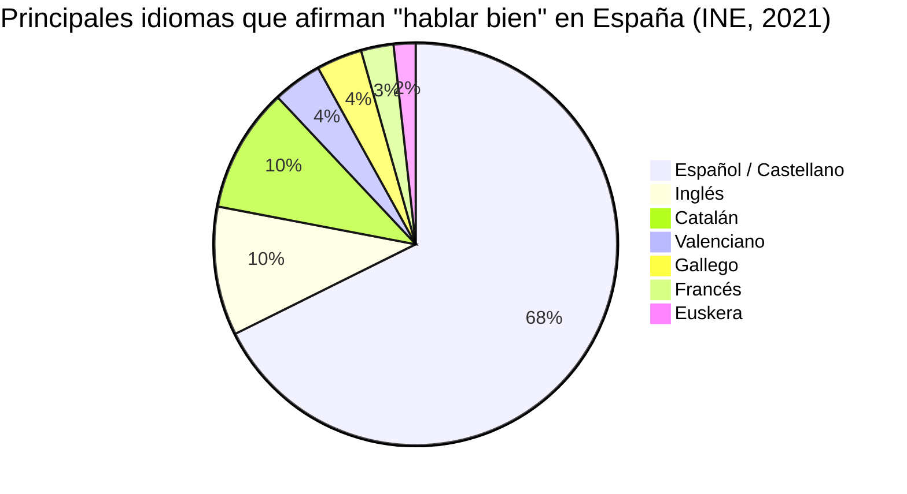
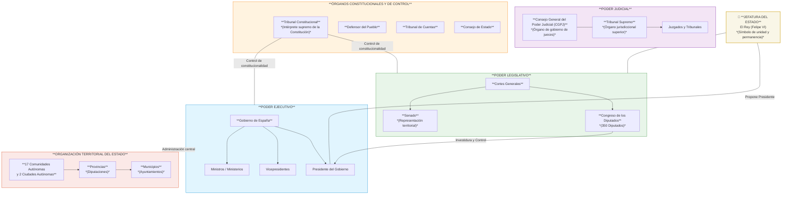

# Clase Cuatro - 28 de Septiembre 2026

# Repaso

* LLM
  * Distintos LLM
    * Propietarios
    * Open Source
      * Uso Local
        * LMStudio
        * Ollama
      * HuggingFace (HF)
        * Crear cuenta
        * Spaces : Lugares para probar los modelos OS sin descargarlos
    * Estado actual LLM
      * https://arena.ai/
* Prompt engineering
  * Formula = Tarea + Contexto + Rol + Ejemplo + Formato + Tono
  * Rol
    * Tecnica de Prompting Rol / Persona
    * Panel de Experto
* Etica e Uso Reponsable

---

# Rquisitos

* Crearse una cuenta en HF

--

# Prompt Engineering

---

## Rol Persona

* Ejemplo de Rol/Persona
  * https://github.com/estebancalabria/Intro-Ia/tree/main/Prompt%20Engineering/Patrones%20de%20Prompting/Persona

---
## Contexto

### Dar el contexto suficiente

* Usar modo dictado
  * Una solapa sin el modo dictado
      * "Redactame un correo para mi jefe para pedir un aumento"

```
Hola [Nombre],

Quería pedirte si podemos tener una breve reunión para conversar sobre mi situación y, en particular, sobre mi compensación actual.

Durante este tiempo he tratado de mantener un alto nivel de compromiso con mi trabajo, cumpliendo con mis responsabilidades y buscando aportar valor al equipo. Por eso, me gustaría revisar si podemos actualizar mi remuneración para que esté más alineada con mi situación actual y con el aporte que estoy realizando.

Es un tema importante para mí y me gustaría poder conversarlo personalmente, con total apertura y buscando encontrar una alternativa que resulte razonable para ambas partes.

Cuando tengas un momento, coordinamos.

Muchas gracias.

Saludos,
Esteban

```

  * Usando el modo dictado
      * "Bueno, quiero redactar un mail para mi jefe para pedirle un aumento. Mi jefe responde muy bien a pedidos emotivos. es un fanático del Barcelona, por lo que siempre toma bien que le mencione temas del Barcelona. La verdad que he sido muy buen empleado, no falté nunca y sinceramente lo que gano no me alcanza para pagar mi vida, ¿no? Así que es muy importante abordar este tema con tacto, tratar de encontrarle una óptica, un ángulo para que a mi jefe le funcione y me pueda dar un aumento. Ya sé que es difícil que él suela dar aumentos, pero creo que si lo persuadimos podemos ser bastante efectivos pidiéndole un aumento."

```
Hola [Nombre],

Quería escribirte porque hay un tema que hace tiempo vengo pensando y que me gustaría poder conversar con vos: mi remuneración.

Creo sinceramente que durante todo este tiempo he demostrado compromiso con la empresa y con mi trabajo. No he faltado nunca, siempre traté de estar disponible cuando fue necesario y, más allá de las tareas concretas del día a día, siempre intenté aportar desde el lugar que me toca y responder de la mejor manera posible.

Por eso quería plantearte algo que para mí es importante: hoy mi remuneración ya no me resulta suficiente para sostener mi situación personal y mi día a día. No es una cuestión de querer simplemente “ganar más”, sino de que siento que llegó un punto en el que necesito que mi compensación acompañe un poco más la realidad en la que estoy.

Sé que no es habitual para vos otorgar aumentos y justamente por eso me costó bastante decidirme a escribirte. No quiero planteártelo como una exigencia, sino como una conversación sincera entre dos personas que vienen trabajando juntas desde hace tiempo.

Y, salvando las distancias, creo que hay algo del Barcelona que siempre me hizo pensar en esto: los equipos que realmente funcionan necesitan cuidar a las personas que están comprometidas con el proyecto. No alcanza solamente con que estén en la cancha; también es importante que sientan que su esfuerzo es reconocido.

Yo me siento parte del equipo y valoro mucho haber construido ese vínculo con vos y con la empresa. Justamente por eso prefiero hablarlo de frente y buscar juntos una alternativa que sea posible para la empresa y que, al mismo tiempo, me permita sentir que puedo seguir adelante con tranquilidad.

Me gustaría que podamos conversar sobre la posibilidad de revisar mi remuneración y encontrar un número que podamos considerar razonable para ambas partes.

Gracias por leerme y, sobre todo, por tomarte el tiempo de considerarlo.

Un abrazo,

Esteban

```
   
> [!NOTE]
> Siempre esta bueno generar un contexto con mucha infromacion, no escatimar en detalles, "hablarle mucho" a la ia para que tenga informacion en la que basar su respuesta y que no termine siendo una respuesta generica

### Interaccion 

* En una forma mas generica se conoce como Prompt-Chainning o encadenamiento de promps
* Tener una convesacion con la ia previo a darle la tarea para generar un contexto con toda la informacion necesaria para dar una respuesta mas efectiva

* Solapa 1
  * Sin Interaccion
  * Armame la dieta de del dia de hoy. Dame una respuesta directa.
* Solapa 2
  * Con interaccion
  * Armame la dieta de del dia de hoy. Quiero que me hagas preguntas de A UNA hasta que tengas toda la informacion necesaria para darme la respuesta mas adaptada a mis deseos y necesidades

 ---
 BREAK
 HASTA y 10
 -----

 ## Formatos de Salida

 * Para empezar vamos a pedirle una lista de algo
     * "Quiero una lista de las mejores peliculas ganadoras del oscar a mejor pelicula, quiero el anio, el genero,  el director, el protagonista, la tematica y el puntaje en imdb."

---

## Formatos Sencillos

* En Tabla
    * "Dame la lista en un tabla. **Responder la tabla sin acotar nada mas.**"
* En Bullets
    * "Dame la lista ahora en bullets y sub bullets"

---

## Formatos Tecnicos

* JSON
* XML
* CSV
  * Comma sepparated Values
  * Lo abre excel directamente
  * Es ideal tambien para pasarle daros a la IA para que los interprete
* Codigo Fuente

---

## Formatos De Presentacion

* PDF
  * Necesita que el llm que estemos usando tenga el interprete de codigo
  * La personalizacion de la salida en cuanto estilos y colores es bastate limitada
* En 365 / Copilot
    * Word
    * Powerpoint
* HTML
  * Se le puede pedir la salida en html
  * Podemos iterar hasta tener el resultado deseado
  * Finalmente el html generado se puede usar como esta o imprimir en pdf

> [!NOTE]
> ChatGPT no me genero el pdf. Asi que para generarlo voy a usar el html

```
Bueno, en ese caso genreame la lista como un html, listo para imprimir en pdf pero que se vea moderno, elegante, impactante, y profesional.
```

---

## Personalizacion basada en plantilla

* Voy a utilizar el lenguaje markdown para definir una plantilla exacta de como quiero la salida
  * Markdown es el lenguaje que usa internamente los LLM para generar una respuesta y que al mostrarse en el navegador tenga formato
  * https://es.wikipedia.org/wiki/Markdown
 
* Vamos a utilizar makdown para generar una plantilla de como queremos exactamente la salida

```
# [TITULO PELICULA]

## Datos Generales

* Lanzamiento : [ANIO_PELICULA]
* Genero : [GENERO_PELCULA]
* Director : [DIRECTOR]
* Puntaje IMDB : [PUNTAJE MOSTRADO CON EMOJI DE ESTRELLAS]

## ACTORES

* [ACTOR 1] -> [PERSONAJE AL QUE INTERPRETA]
* [ACTOR 2] -> [PERSONAJE AL QUE INTERPRETA]
...

## ARGUMENTO

> [SINOPSIS DEL ARGUMENTO]

---  (Separador)

```

 ---
 BREAK
 HASTA y 10
 -----

 ## Formatos de Generacion de Diagramas

 ### Mermaid

* URL
 * https://mermaid.live/
* Es un lenguaje estandar que pemite generar diagramas a partir de texto
* La IA utiliza muy bien este lenguaje y en general provee una previsualizacion

* PIE
  * Ejemplo : "Dame un diagrama mermaid de PIE que muestre los principales idiomas hablados en España según el porcentaje de población que los habla bien, utilizando datos del INE."



* Flowchart
 * "Dame un ejemplo de flowchart mermaid donde se vea el organigrama del estao de España"



### SVG

* Lenguaje basado en xml
* Scalable Vector Graphics
* Se usa cuando quiero generar un diagrama que mermaid no tiene (como por ejemplo el de barras) y poder personalizarl

```
Dame un SVG donde se vea en un grafico de barras el ingreso promedio por grupos 
```

* Me devuelve

```svg
<svg xmlns="http://www.w3.org/2000/svg" width="900" height="550" viewBox="0 0 900 550">
  <style>
    .title { font: bold 26px Arial; fill: #222; }
    .label { font: 16px Arial; fill: #333; }
    .value { font: bold 15px Arial; fill: #222; }
    .axis { stroke: #555; stroke-width: 2; }
    .grid { stroke: #ddd; stroke-width: 1; }
    .bar { fill: #4e79a7; }
  </style>

  <!-- Título -->
  <text x="450" y="45" text-anchor="middle" class="title">
    Ingreso promedio por grupo
  </text>

  <!-- Líneas de referencia -->
  <line x1="130" y1="100" x2="830" y2="100" class="grid"/>
  <line x1="130" y1="180" x2="830" y2="180" class="grid"/>
  <line x1="130" y1="260" x2="830" y2="260" class="grid"/>
  <line x1="130" y1="340" x2="830" y2="340" class="grid"/>
  <line x1="130" y1="420" x2="830" y2="420" class="grid"/>

  <!-- Ejes -->
  <line x1="130" y1="100" x2="130" y2="420" class="axis"/>
  <line x1="130" y1="420" x2="830" y2="420" class="axis"/>

  <!-- Escala -->
  <text x="115" y="425" text-anchor="end" class="label">$0</text>
  <text x="115" y="345" text-anchor="end" class="label">$1.000</text>
  <text x="115" y="265" text-anchor="end" class="label">$2.000</text>
  <text x="115" y="185" text-anchor="end" class="label">$3.000</text>
  <text x="115" y="105" text-anchor="end" class="label">$4.000</text>

  <!-- Barras -->
  <rect x="180" y="340" width="90" height="80" class="bar"/>
  <rect x="320" y="300" width="90" height="120" class="bar"/>
  <rect x="460" y="220" width="90" height="200" class="bar"/>
  <rect x="600" y="160" width="90" height="260" class="bar"/>
  <rect x="740" y="200" width="70" height="220" class="bar"/>

  <!-- Valores -->
  <text x="225" y="330" text-anchor="middle" class="value">$1.000</text>
  <text x="365" y="290" text-anchor="middle" class="value">$1.500</text>
  <text x="505" y="210" text-anchor="middle" class="value">$2.500</text>
  <text x="645" y="150" text-anchor="middle" class="value">$3.250</text>
  <text x="775" y="190" text-anchor="middle" class="value">$2.750</text>

  <!-- Categorías -->
  <text x="225" y="450" text-anchor="middle" class="label">18–24</text>
  <text x="365" y="450" text-anchor="middle" class="label">25–34</text>
  <text x="505" y="450" text-anchor="middle" class="label">35–44</text>
  <text x="645" y="450" text-anchor="middle" class="label">45–54</text>
  <text x="775" y="450" text-anchor="middle" class="label">55+</text>

  <text x="450" y="500" text-anchor="middle" class="label">
    Grupo de edad
  </text>
</svg>
```

### MatPlotLib

* Es la libreria estandar de Python para hacer gracos utilizada en todo lo que tiene que ver con Analisis de Datos
* Para usarla no hace falta saber programar, sino pedirle a la IA que la utilice
* Podemos ver la previsualizacion del grafio si el LLM tiene habilitado el interprete de codgio
  * https://matplotlib.org/
  * https://matplotlib.org/stable/gallery/index

* PAra verificar si tiene el interprete de codigo habilitado
```
Tenes habilitado el interprete de codigo?
```

* 
