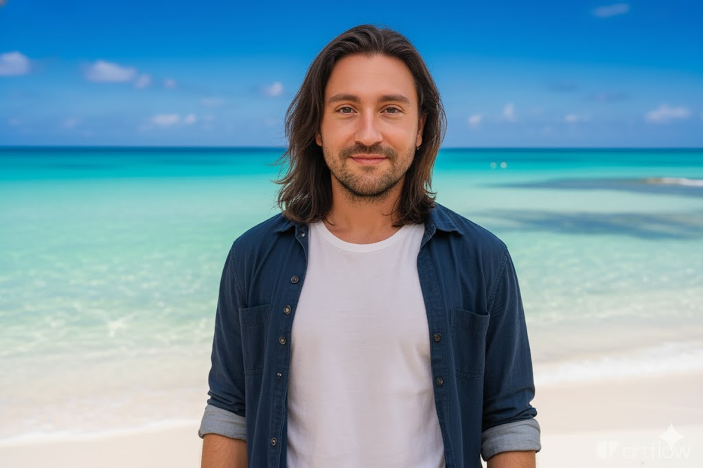

# Prompts para la generacionde Imagenes en Nano Banana

- # Modificar Imagenes en Paisajes Paradisiacos

> Quisiera que cambies el escenario total de la foto, por un paisaje de una playa de ensueño, con un mar increible de aguas cristalinas y transparentes, misma postura de la fotografia, el cielo con un azul europeo nitido con luces y sombras que iluminan a la modelo, con un desenfoque de una camara DSRL de 85mm, que tenga armonia el cuerpo, toda la foto que sea con sombras naturales de un dia soleado, El cabello es largo y liso con un peinado natural; maquillaje suave pero llamativo con brillo en la piel. La foto debe estar tomada con una camara DSRL con flash, replicando el estilo característico de esta cámara: iluminación directa y cálida, el sujeto iluminado con flash, colores intensos y un estilo editorial-glamoroso. Alta resolución, realismo fotográfico, conservar los detalles del rostro y facciones sonriendo un poco

